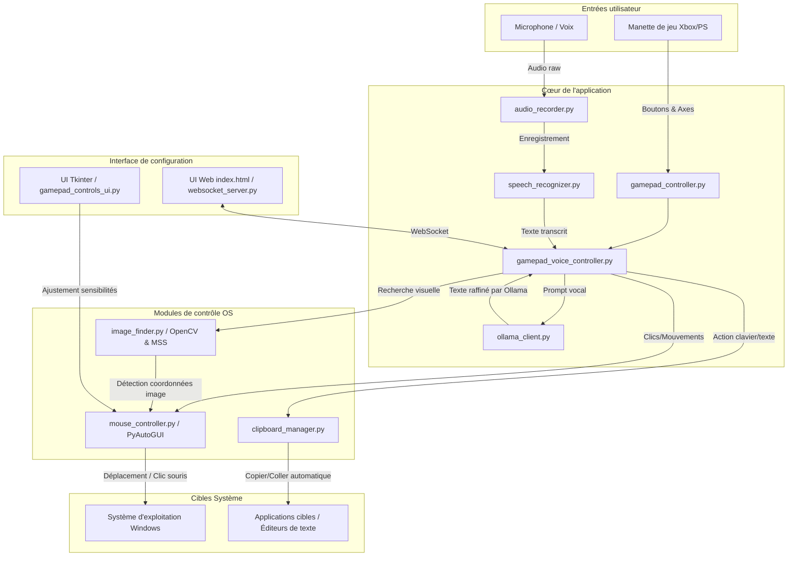

# 🎮 JARVIS V2 — Contrôle PC par Manette et Dictée Vocale Assistée par IA 🎤

[](https://github.com/ServOMorph/jarvis_V2/actions)

**JARVIS V2** est une boîte à outils modulaire en **Python** conçue pour l'accessibilité numérique et l'automatisation mains-libres. Elle permet de contrôler intégralement un système d'exploitation à l'aide d'une manette de jeu (Xbox, PlayStation) et d'un système de dictée vocale intelligent couplé à une IA locale (**Ollama**). Grâce à une architecture découplée, le projet offre également des modules réutilisables pour simuler les entrées utilisateur (souris, clavier), effectuer des captures et de la détection d'images à l'écran, et interagir avec des modèles de langage locaux.

---

## 🚀 Lancement rapide

```bash
# Installer les dépendances
pip install -r requirements.txt

# Lancer l'application
python main.py
```

## 🔄 Mode Développement (Hot Reload)

```bash
python dev_server.py
```

Le serveur de développement (port 5500) :
- Surveille les fichiers `.py` et `.json`
- Relance automatiquement le projet à chaque modification
- Affiche les logs en temps réel

---

## 📋 Fonctionnalités

- **Contrôle de la souris** ultra-réactif avec les joysticks de la manette.
- **Raccourcis clavier système** via les boutons de la manette (Alt+Tab, Ctrl+W, Volume, etc.).
- **Dictée vocale intelligente** : maintenez un bouton, parlez, et le texte reconnu est automatiquement collé.
- **Assistance IA locale (Ollama)** : le texte dicté peut être traité par un LLM local (ex: `gemma3:4b` ou `phi3:mini`) pour corriger la grammaire, reformuler ou générer du code à la volée.
- **Détection visuelle et Clic Auto** : recherche d'images de référence (comme `yes.png`) sur l'écran et clic automatique, avec gestion multi-moniteurs native (`screeninfo`, `mss`).
- **Interface graphique de configuration** pour calibrer la sensibilité et les zones mortes de la manette.
- **Interface Web standalone** : interface de contrôle et retour d'information via WebSocket.

---

## 🏗️ Architecture et Fonctionnement

Le projet est conçu de manière modulaire pour séparer l'interaction avec le matériel (manette, microphone), le traitement intelligent (moteurs vocaux, Ollama) et l'actionnement sur l'OS (souris, presse-papier).

### Diagramme d'Architecture



### Structure du projet

```
jarvis_V2/
├── main.py                     # Point d'entrée principal
├── run.py                      # Wrapper lanceur standard
├── run_ui_html.py              # Lanceur de l'interface graphique WebSocket + HTML
├── dev_server.py               # Serveur de dev avec hot-reload
├── requirements.txt            # Dépendances du projet
├── config/                     # Fichiers de configuration
│   ├── voice_config.json       # Mapping des boutons et config voix
│   └── mouse_settings.json     # Configuration persistante de la souris
├── outils/                     # Outils bas niveau réutilisables
│   ├── audio_recorder.py       # Enregistrement audio
│   ├── speech_recognizer.py    # Reconnaissance vocale (Google, Whisper, Sphinx)
│   ├── clipboard_manager.py    # Gestion du presse-papier
│   ├── mouse_controller.py     # Émulation de la souris (joystick)
│   ├── image_finder.py         # Recherche d'images (multi-écrans)
│   ├── auto_clicker.py         # Clic automatique sur patterns d'image
│   └── ollama_client.py        # Client léger pour Ollama local
├── modules/                    # Logique applicative
│   ├── gamepad_controller.py   # Gestion de la manette via Pygame
│   ├── gamepad_voice_controller.py # Extension manette + dictée vocale + Ollama
│   └── copier_coller.py        # Dictée vocale autonome
└── ui/                         # Interface de configuration
    └── gamepad_controls_ui.py  # Calibration Tkinter
```

---

## 🚀 Installation & Prérequis

### 1. Installer les dépendances

Le projet fonctionne avec Python 3.11+.

```bash
pip install -r requirements.txt
```

### 2. Configuration audio (Windows)

Pour faire fonctionner PyAudio sous Windows, vous pourriez avoir besoin d'installer le package précompilé :

```bash
pip install pipwin
pipwin install pyaudio
```

### 3. Installer et lancer Ollama (Optionnel)

Pour utiliser l'assistant vocal augmenté par IA :
1. Téléchargez Ollama depuis [ollama.com](https://ollama.com).
2. Lancez le serveur local Ollama.
3. Téléchargez le modèle par défaut :
   ```bash
   ollama run gemma3:4b
   ```

---

## 🎯 Utilisation

### Lancer le programme principal (Manette + Voix)

```bash
python main.py
```

### Lancer l'interface Web (WebSocket)

```bash
python run_ui_html.py
```

### Lancer les tests manuels

Tester la manette seule :
```bash
python tests/manuels/test_gamepad_buttons.py
```

Tester la dictée vocale autonome :
```bash
python modules/copier_coller.py
```

---

## 🎮 Configuration par défaut de la manette

### Boutons

| Bouton | Nom Xbox | Action par défaut |
|---|---|---|
| **0** | A | Clic gauche de la souris |
| **1** | B | Toggle recherche & clic continu sur `yes.png` |
| **2** | X | Clic droit de la souris |
| **3** | Y | 🎤 **DICTÉE VOCALE** (maintenir pour enregistrer, relâcher pour coller) |
| **4** | LB | Alt+Tab (Changement d'application) |
| **5** | RB | Ctrl+W (Fermer l'onglet actif) |
| **6** | Back | Baisser le volume sonore |
| **7** | Start | Augmenter le volume sonore |

### Joysticks

- **Joystick Gauche** : Déplacer le curseur de la souris (vitesse dynamique avec courbe d'accélération).
- **Joystick Droit (axe Y)** : Défilement vertical (Scroll haut/bas).

---

## ⚙️ Configuration personnalisée

Toutes les configurations sont stockées dans `config/` :

- **`config/voice_config.json`** : Mappez les boutons à des fonctions système personnalisées (`mouse_click_left`, `mouse_click_right`, `alt_tab`, etc.) et modifiez les paramètres du moteur de reconnaissance vocale (`google`, `whisper`, `sphinx`).
- **`config/mouse_settings.json`** : Modifiez la sensibilité, le lissage, la zone morte et la courbe d'accélération de la souris. Ces paramètres sont mis à jour à l'aide de l'interface graphique de configuration.

---

## 🧩 Exemples de code (Réutilisation des outils)

Tous les outils de la boîte `outils/` sont indépendants et peuvent être importés dans d'autres scripts.

### Enregistrement Audio et Transcription

```python
from outils.audio_recorder import AudioRecorder
from outils.speech_recognizer import SpeechRecognizer, RecognitionEngine

# 1. Enregistrement
recorder = AudioRecorder()
print("Enregistrement en cours...")
recorder.start_recording()
# ... parler dans le micro ...
audio_data = recorder.stop_recording()
recorder.save_to_file("output.wav", audio_data)

# 2. Transcription
recognizer = SpeechRecognizer(engine=RecognitionEngine.GOOGLE, language="fr-FR")
text = recognizer.listen_from_microphone() # Ou depuis un fichier
print(f"Texte transcrit : {text}")
```

### Client IA Ollama Local

```python
from outils.ollama_client import OllamaClient

client = OllamaClient(model="gemma3:4b", timeout=60)
reponse = client.ask("Corrige les fautes de ce texte : 'le chat mangea la souri'")
print(f"Correction : {reponse}")
```

---

## 📄 Licence

Ce projet est distribué sous licence MIT. Consultez le fichier [LICENSE](LICENSE) pour plus de détails.

Copyright (c) 2026 ServOMorph
